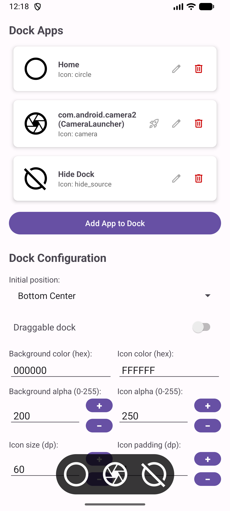
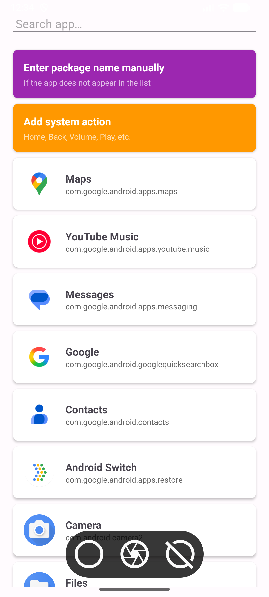
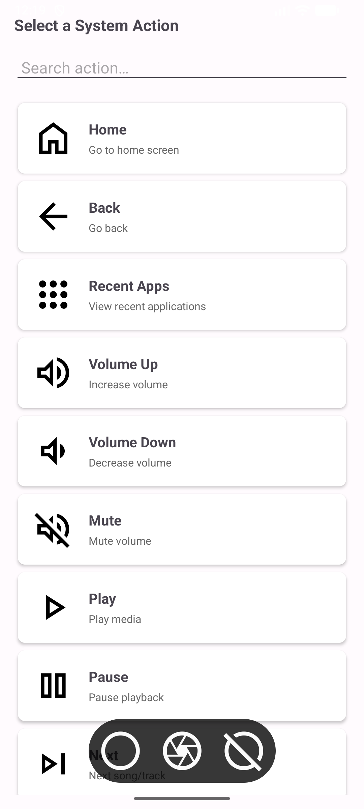

# Floating Dock

A customizable floating dock for Android that allows you to quickly access your favorite applications and system actions from any screen.

<div align="center">
  
  
  
</div>

## 📥 Download

[](https://github.com/joshepw/FloatingDock/releases/latest)

**Download the latest APK version from [Releases](https://github.com/joshepw/FloatingDock/releases/latest)**

## 📱 Description

Floating Dock is an application that creates a floating dock on your Android device, allowing you to quickly access your applications and system actions without needing to return to the launcher. The dock appears over other applications and can be fully customized according to your preferences.

## ✨ Features

- **Floating Dock**: Access your favorite applications from any screen
- **System Actions**: Control functions like Home, Back, Volume, Media playback, Hide Dock, and more
- **Draggable Dock**: Enable dragging mode to reposition the dock anywhere on screen (long-press for 1 second)
- **Dock Behavior**:
  - **Hide on action**: Dock can be hidden using the "Hide Dock" system action
  - **Hide after time**: Dock automatically hides after a configurable timeout (1-60 seconds)
- **Auto-start App**: Configure a specific app to launch automatically when the service starts
- **Full Customization**:
  - Configurable icon size
  - Initial dock position (8 positions available)
  - Background color and transparency
  - Icon color and transparency
  - Dock border radius
  - Icon spacing
  - Icon padding
  - Separate horizontal and vertical margins (supports negative values for off-screen positioning)
  - Hide timeout configuration (when using "Hide after time" behavior)
- **Material Symbols Icons**: Over 4,000 icons available (dynamically loaded from JSON)
- **Native Icons**: Option to use each application's native icon
- **Activity Selection**: For apps with multiple activities (like car launchers)
- **Auto Start**: The service starts automatically on system boot
- **Real-time Updates**: Configuration changes are applied instantly with smooth animations
- **Multi-language Support**: English and Spanish

## 🚀 Installation

1. Download the APK file from the [Download](#-download) section above or from [Releases](https://github.com/joshepw/FloatingDock/releases/latest)
2. Enable installation from unknown sources on your Android device
3. Install the APK
4. Open the application and grant the necessary permissions:
   - **Overlay permission**: Required to display the dock over other applications
   - **Auto-start permission**: For the service to start on device boot

## 📖 How to Use

### Initial Setup

1. **Permissions**: When opening the app for the first time, you will be prompted for overlay permission. Go to Settings and enable "Display over other apps" for Floating Dock.

2. **Adding Applications to the Dock**:
   - Tap the "Add app to dock" button
   - Select an application from the list
   - If the app has multiple activities, select the one you want to use
   - Choose a Material Symbol icon or use the app's native icon
   - The dock will update automatically

3. **Adding System Actions**:
   - Tap the "Add app to dock" button
   - Select "Add system action"
   - Choose the action you want (Home, Back, Volume, etc.)
   - Select a Material Symbol icon
   - The action will be added to the dock

### Dock Customization

All settings are saved automatically and applied immediately:

- **Icon Size**: Adjust the size of icons in the dock (in dp)
- **Initial Position**: Select where the dock will appear (top left, center, bottom right, etc.)
- **Border Radius**: Control how rounded the dock corners are
- **Background Color**: Customize the dock background color
- **Background Transparency**: Adjust background opacity (0-255)
- **Icon Color**: Change the color of dock icons
- **Icon Transparency**: Adjust icon opacity (0-255)
- **Icon Spacing**: Control the space between dock icons
- **Icon Padding**: Adjust the internal space of each icon
- **Margins**: Configure the dock distance from screen edges separately for horizontal (X) and vertical (Y) axes. Supports negative values for off-screen positioning
- **Dock Draggable**: Toggle to enable/disable dock dragging. When enabled, long-press (1 second) on the dock or icons to drag
- **Dock Behavior**: Choose how the dock behaves:
  - **Hide on action**: Dock can be hidden using the "Hide Dock" system action
  - **Hide after time**: Dock automatically hides after a configurable timeout
- **Hide Timeout**: Configure the timeout in seconds (1-60) for auto-hide behavior (only visible when "Hide after time" is selected)

### Application Management

- **Edit**: Tap the edit icon to change an app's icon or activity
- **Delete**: Tap the delete icon to remove an app from the dock
- **Auto-start**: Tap the rocket icon to configure an app to launch automatically when the service starts (only one app can be set)
- **Reorder**: Apps are displayed in the order they were added

## 🎯 Use Cases

- **Android Cars**: Quick access to Radio, AC, Navigation, and other system apps
- **Productivity**: Quick access to work applications without leaving the current app
- **Gaming**: Quick control of system functions during gameplay
- **Accessibility**: Facilitates app access for users with mobility difficulties

## ⚙️ Requirements

- Android 7.0 (Nougat) or higher
- Overlay permission (SYSTEM_ALERT_WINDOW)
- Auto-start permission (optional but recommended)

## 🔧 Troubleshooting

### The dock doesn't appear
- Verify that you have overlay permission enabled
- Restart the application
- Verify that you have added at least one application to the dock

### The service doesn't start automatically
- Some manufacturers require manually enabling auto-start in Settings > Apps > Floating Dock > Auto-start
- Restart the device after enabling the permission

### Icons don't display correctly
- Make sure the Material Symbols font is installed correctly
- If an icon doesn't appear, try selecting another from the list

## 📝 Notes

- Configuration changes are applied immediately without needing to save
- The service runs in the background and consumes minimal resources
- The application requires overlay permission to function correctly
- Dock can be dragged when draggable mode is enabled (long-press for 1 second)
- Dock can be hidden automatically after a timeout or manually using the "Hide Dock" action

## 🤝 Contributions

Contributions are welcome. If you find a bug or have a suggestion, please open an issue in the repository.

## 🎨 Development Credits

This application was developed **100% through AI-assisted prompts** as an experiment to demonstrate the quality and capabilities of AI-powered development. The entire codebase, features, and functionality were created through iterative prompt-based development.

### AI Development Statistics

- **Development Method**: 100% prompt-based development
- **Approximate Prompts**: 60+ user prompts/interactions
- **AI Assistant**: Auto (Cursor AI)
- **Development Approach**: Iterative feature development through natural language instructions
- **Token Usage**: Significant token usage throughout the development process (exact count not available, but represents substantial AI processing for code generation, debugging, and feature implementation)

This project serves as a testament to how modern AI coding assistants can help create fully functional, production-ready Android applications through clear communication and iterative refinement. Every feature, from basic UI components to complex animations and system integrations, was developed through natural language prompts and AI-generated code.

## 📄 License

This project is open source and available under the license specified in the repository.

## 💰 Donations

If this project has been useful to you and you wish to support its development, you can make a donation using cryptocurrencies:

### Bitcoin (BTC)

[](bitcoin:[TU_DIRECCION_BITCOIN_AQUI])

```
bc1q9nlvf63ny8sn0wwy0jmgl0d0qtsepffqhx2uqh
```

### Ethereum (ETH)

[](ethereum:[TU_DIRECCION_ETHEREUM_AQUI])

```
0xFC9279fEe715Db4225cfbdde25595E701bfC3265
```

### USDC (USD Coin)

[](ethereum:0xFC9279fEe715Db4225cfbdde25595E701bfC3265)

```
0xFC9279fEe715Db4225cfbdde25595E701bfC3265
```

**Note**: USDC is an ERC-20 token on the Ethereum network. This address can also receive any ERC-20 token (USDT, DAI, UNI, etc.) and any other network compatible with Ethereum addresses (Polygon, BSC, Arbitrum, Optimism, etc.).

---

**Developed with ❤️ for the Android community**
